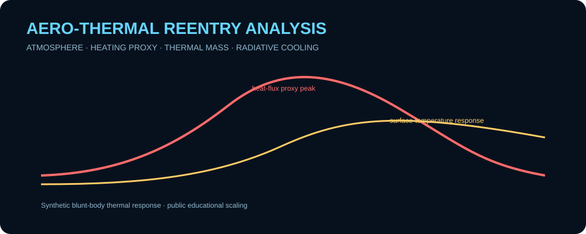
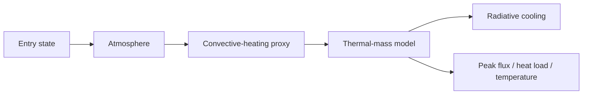

# Aero-Thermal Reentry Analysis

  

A runnable synthetic thermal-response study for a **generic blunt-body atmospheric-entry problem**. It couples an exponential atmosphere, a normalized convective-heating relationship, lumped thermal mass, and radiative cooling to produce time histories and peak thermal metrics.

> All constants are generic educational values. This is not a certified thermal-protection-system design tool and is not validated against a real vehicle.

<p align="center"></p>

## Features

- altitude-dependent exponential atmosphere
- configurable synthetic nose radius and ballistic coefficient
- Sutton-Graves-style **normalized heating proxy** for educational scaling
- lumped surface thermal-mass integration
- radiative cooling term
- heat-flux history
- accumulated heat-load metric
- surface-temperature response
- peak heat flux, peak temperature, and timing metrics
- CSV/JSON outputs, tests, and GitHub Actions CI

## Architecture



## Quick start

```bash
git clone https://github.com/skytruong90/Aero-Thermal-Reentry-Analysis.git
cd Aero-Thermal-Reentry-Analysis
python thermal.py --duration 80 --output artifacts
```

Run the tests:

```bash
python -m unittest discover -s tests -v
```

## Outputs

The CSV time history records atmospheric state, speed/altitude, normalized heating, integrated heat load, and surface-temperature response. The JSON report captures peak values, their timing, and the terminal thermal state.

## Engineering assumptions

The atmosphere uses a simple exponential density law. The convective term follows the qualitative dependence of common stagnation-point heating correlations but is deliberately normalized rather than calibrated to a real system. Surface response is represented by one lumped temperature state with radiative energy loss.

The goal is to demonstrate **software coupling and engineering trend analysis**, not TPS sizing.

## Validation strategy

Automated tests check density monotonicity, nonnegative heating, finite temperature integration, deterministic results, peak-metric extraction, and artifact generation. CI runs the suite plus a short smoke analysis.

## What I learned / demonstrated

- how atmospheric density and speed jointly drive convective-heating trends
- why heat-flux peak and surface-temperature peak do not necessarily occur at the same time
- how heat load integrates the entire thermal history rather than one instantaneous maximum
- how radiative cooling changes the transient thermal response
- how to document normalized engineering proxies so they are not mistaken for validated design predictions

## Limitations

The project omits real-gas chemistry, shock-layer physics, material conduction, ablation, catalytic effects, detailed radiation, multi-node thermal networks, high-fidelity atmosphere, and validated material properties. It should not be used for real TPS design decisions.

## Public-data disclaimer

All values and trajectories are synthetic and public-safe.